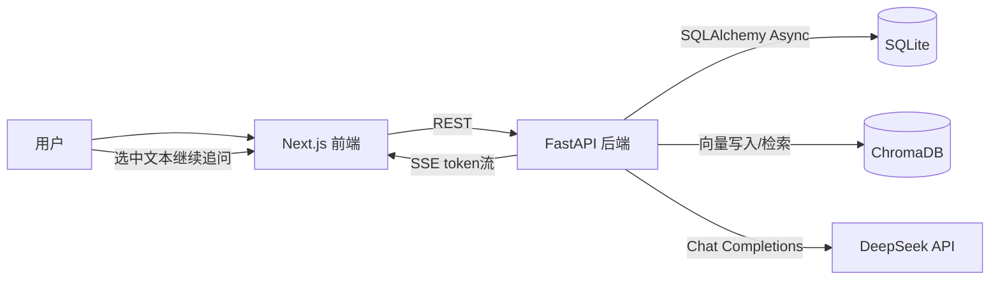

# Human Learning Agent 技术文档

## 1. 项目定位

Human Learning Agent 是一个“树状学习问答系统”：
- 每次提问会形成一个节点。
- 用户可从已有回答中选中文本继续追问，形成子节点。
- 后端将祖先问答链作为上下文，按深度持续展开。
- 系统同时支持 RAG（文档检索增强）与学习检查（复习/深入/连接）。

核心价值：把线性对话变成可回溯、可复用、可复习的知识树。

## 2. 技术栈

### 2.1 前端
- Next.js 16（App Router）
- React 19 + TypeScript
- Tailwind CSS
- TanStack Query（服务端状态）
- Zustand（客户端流式状态）
- react-markdown + remark/rehype + KaTeX（Markdown/数学渲染）

### 2.2 后端
- FastAPI + Uvicorn
- SQLAlchemy 2.0（异步）+ SQLite
- sse-starlette（SSE 流式输出）
- OpenAI SDK（兼容 DeepSeek）
- ChromaDB + sentence-transformers（向量检索）
- pypdf / beautifulsoup4 / httpx（多源文档处理）

## 3. 仓库结构

```text
human-learning-agent/
├── backend/
│   ├── app/
│   │   ├── api/                # trees/nodes/rag/study 路由
│   │   ├── models/             # SQLAlchemy 模型
│   │   ├── schemas/            # Pydantic 请求响应模型
│   │   ├── services/           # LLM、上下文构造、RAG、学习规划
│   │   ├── utils/              # 文本切分
│   │   ├── config.py           # 环境变量配置
│   │   ├── database.py         # 引擎、会话、初始化
│   │   └── main.py             # FastAPI 入口
│   ├── data/                   # sqlite + chroma 持久化目录
│   ├── uploads/                # 上传目录
│   ├── requirements.txt
│   └── start.bat
├── frontend/
│   ├── app/                    # 首页、树页面、节点页、学习页
│   ├── components/             # node/tree/rag/ui 组件
│   ├── hooks/                  # 流式与选区行为
│   ├── lib/                    # API 客户端 + Zustand store
│   ├── types/
│   ├── next.config.ts
│   └── start.bat
└── PLAN.md
```

## 4. 系统架构与数据流



### 4.1 问答主流程
1. 前端创建节点：`POST /api/nodes`（先拿到 node_id）。
2. 前端发起流式：`GET /api/nodes/{id}/stream`。
3. 后端构造上下文（祖先问答 + RAG 片段）并调用 LLM。
4. token 通过 SSE 持续推送到前端。
5. 流结束后后端写回 `nodes.answer`，并触发知识抽取任务。

### 4.2 RAG 流程
1. 文档来源：PDF 上传、纯文本、URL 抓取。
2. 文本按段落优先切分（默认 chunk_size=512, overlap=64）。
3. 句向量写入 Chroma，元数据包含 `tree_id`。
4. 问答时按 `tree_id + global` 检索 top-k 片段注入 system context。

### 4.3 学习检查流程
1. 根据 knowledge item + learning state 评分选题。
2. 生成 `GeneratedQuestion`（review/deepen/connect）。
3. 用户提交结果写入 `ReviewEvent`，并更新 `LearningState`（mastery/confidence/下次复习时间）。

## 5. 数据模型

### 5.1 核心表
- `trees`：学习树元信息。
- `nodes`：问答节点（父子关系、标题、问题、回答、深度）。

### 5.2 学习相关表
- `knowledge_items`：从回答提取出的知识点。
- `knowledge_edges`：知识点间关系。
- `learning_states`：掌握度、信心、错题统计、复习时间。
- `generated_questions`：系统生成题目。
- `review_events`：作答结果日志。

## 6. 后端模块说明

### 6.1 `app/main.py`
- 生命周期启动时：
  - 创建数据目录。
  - 初始化数据库表。
  - 预加载 RAG singleton（含 embedding 模型）。
- 挂载路由：trees / nodes / rag / study。
- 开放健康检查：`GET /api/health`。

### 6.2 `app/api/trees.py`
- 列表、创建、删除树。
- 创建树时同步创建 root node。
- `GET /api/trees/{tree_id}/nodes` 返回扁平节点列表，并做标题纠偏。

### 6.3 `app/api/nodes.py`
- `GET /api/nodes/{id}`：获取节点并在必要时刷新标题。
- `POST /api/nodes`：创建子节点（answer 初始为空）。
- `GET /api/nodes/{id}/stream`：SSE 输出 token，并在结束后持久化 answer。
- `GET /api/nodes/{id}/path`：返回祖先链（root -> current）。

### 6.4 `app/api/rag.py`
- 支持三种摄入：`/upload`、`/text`、`/url`。
- 支持来源列表与删除。

### 6.5 `app/api/study.py`
- `GET /api/trees/{tree_id}/study/next?mode=...`。
- `POST /api/study/events`。
- `GET /api/trees/{tree_id}/knowledge`。
- `GET /api/trees/{tree_id}/weaknesses`。

### 6.6 关键服务
- `context_builder.py`：按祖先链组装 messages。
- `llm_service.py`：DeepSeek 流式/非流式调用封装。
- `rag_service.py`：向量写入、检索、来源管理。
- `knowledge_extractor.py`：回答结束后异步抽取知识图谱。
- `question_planner.py`：学习题选择与复习状态更新。
- `node_title_service.py`：节点标题回退策略与 LLM 生成。

## 7. 前端模块说明

### 7.1 页面层
- `app/page.tsx`：学习树首页（创建/删除/进入）。
- `app/tree/[treeId]/layout.tsx`：树页面框架，负责加载节点并维护侧栏宽度（本地持久化）。
- `app/tree/[treeId]/node/[nodeId]/page.tsx`：节点详情页。
- `app/tree/[treeId]/study/page.tsx`：学习检查页。

### 7.2 组件层
- `components/tree/TreeSidebar.tsx`：递归树渲染、节点跳转、RAG 面板入口、宽度拖拽手柄。
- `components/node/NodeView.tsx`：问题/回答展示，选区追问入口，小框持久化恢复。
- `components/node/InlineAskPanel.tsx`：内联追问面板（可拖拽/缩放/最小化），回答完成后可跳转到完整节点。
- `components/node/AnswerRenderer.tsx`：Markdown + 代码高亮 + KaTeX。
- `components/rag/RagPanel.tsx`：知识源管理（上传/文本/URL）。

### 7.3 状态与网络
- `lib/api.ts`：所有 REST 调用。
- `lib/store.ts`：全局 `nodes` 与 `streaming` 状态。
- `hooks/useStreamAnswer.ts`：SSE 客户端逻辑，token 级刷新。
- `hooks/useTextSelection.ts`：选区矩形信息采集（viewport + content 坐标）。

## 8. 近期交互改进（当前仓库已实现）

1. 小框随锚点滚动：
- 使用“锚点 + 偏移”定位，页面上下滚动时面板跟随。

2. 小框内容稳定显示：
- 面板内引入已解析内容兜底，避免缩放重渲染后回退“正在思考”。

3. 小框持久化：
- 在节点页将小框状态写入 `localStorage`，下次进入同节点可恢复。

4. 小框可点击跳转：
- 已生成节点后，小框标题与右上角按钮均可打开完整节点页。

5. 左侧树栏可调宽：
- 拖拽手柄调节侧栏宽度，范围 220-520，宽度本地持久化。

## 9. API 一览

### 9.1 Trees
- `GET /api/trees`
- `POST /api/trees`
- `GET /api/trees/{tree_id}/nodes`
- `DELETE /api/trees/{tree_id}`

### 9.2 Nodes
- `GET /api/nodes/{node_id}`
- `POST /api/nodes`
- `GET /api/nodes/{node_id}/stream`（SSE）
- `GET /api/nodes/{node_id}/path`
- `GET /api/nodes/{node_id}/panels`
- `PUT /api/nodes/{node_id}/panels`

### 9.3 RAG
- `GET /api/rag/sources`
- `POST /api/rag/upload`
- `POST /api/rag/text`
- `POST /api/rag/url`
- `DELETE /api/rag/sources/{source_id}`

### 9.4 Study
- `GET /api/trees/{tree_id}/study/next`
- `POST /api/study/events`
- `GET /api/trees/{tree_id}/knowledge`
- `GET /api/trees/{tree_id}/weaknesses`

### 9.5 Metrics
- `GET /api/metrics/summary?window_hours=24&tree_id=...`

## 10. 本地运行

### 10.1 后端
1. 进入 `backend`。
2. 执行 `start.bat`：
   - 自动创建 `venv`（若不存在）。
   - 安装依赖。
   - 启动 `uvicorn app.main:app --reload --port 8000`。

说明：
- 默认启用离线模型模式（`TRANSFORMERS_OFFLINE=1`）。
- 若首次需要下载 embedding 模型，设置 `HLA_ALLOW_MODEL_DOWNLOAD=1`。

### 10.2 前端
1. 进入 `frontend`。
2. 执行 `start.bat`（即 `npm run dev`）。
3. 浏览器访问 `http://localhost:3000`。

## 11. 环境变量（后端）

最少需要：
- `DEEPSEEK_API_KEY`

常用可选项：
- `DEEPSEEK_BASE_URL`（默认 `https://api.deepseek.com`）
- `DEEPSEEK_MODEL`（默认 `deepseek-v4-flash`）
- `DEEPSEEK_INPUT_PRICE_PER_1M`（默认 `0.27`，USD）
- `DEEPSEEK_OUTPUT_PRICE_PER_1M`（默认 `1.10`，USD）
- `DATABASE_URL`（默认 sqlite 本地文件）
- `CHROMA_PATH`
- `UPLOAD_DIR`
- `EMBEDDING_MODEL`
- `RAG_TOP_K`
- `CORS_ORIGINS`（JSON 字符串数组）

## 12. 可观测性与成本日志

在 `GET /api/nodes/{node_id}/stream` 链路中，后端会输出结构化 JSON 日志（`node_stream_metrics` / `node_stream_failed`），用于性能与成本观测。

此外，所有指标会落库到 `request_metrics` 表，可用于后续可视化与趋势分析。

每次请求记录以下字段：
- `retrieval_ms`：检索耗时（向量检索）
- `prompt_build_ms`：上下文构造耗时
- `generation_ms`：模型生成耗时
- `ttft_ms`：首 token 延迟（Time To First Token）
- `total_ms`：总耗时
- `input_tokens_est` / `output_tokens_est`：输入输出 token 估算
- `cost_usd_est`：单问成本估算（基于配置单价）
- `rag.total_hits`：总命中文档数
- `rag.global_hits`：命中全局知识库数量
- `rag.tree_hits`：命中当前树知识库数量
- `rag.other_hits`：其他来源命中数量
- `rag.unique_sources`：命中来源去重数量

示例：

```json
{
  "event": "node_stream_metrics",
  "node_id": "...",
  "tree_id": "...",
  "cache_hit": false,
  "retrieval_ms": 17.33,
  "prompt_build_ms": 2.64,
  "generation_ms": 1840.51,
  "ttft_ms": 312.42,
  "total_ms": 1863.15,
  "input_tokens_est": 853,
  "output_tokens_est": 462,
  "cost_usd_est": 0.000737,
  "rag": {
    "total_hits": 5,
    "global_hits": 3,
    "tree_hits": 2,
    "other_hits": 0,
    "unique_sources": 4
  }
}
```

### 12.1 指标汇总接口

新增 `GET /api/metrics/summary`：
- `window_hours`：统计窗口小时数（默认 24）
- `tree_id`：可选，仅统计某棵树

返回字段包括：
- 请求量：`total_requests` / `success_requests` / `failed_requests` / `cache_hit_requests`
- 性能：`avg_total_ms` / `p50_total_ms` / `p95_total_ms` / `avg_ttft_ms`
- 成本：`total_input_tokens_est` / `total_output_tokens_est` / `total_cost_usd_est` / `avg_cost_usd_est`
- 检索来源：`rag_total_hits` / `rag_global_hits` / `rag_tree_hits` / `rag_other_hits` / `rag_unique_sources_sum`

## 13. 关键工程约束与注意事项

1. SSE 端点中写库使用独立会话：
- `get_db` 生命周期结束后会关闭会话，流生成器内部必须重新开会话。

2. 流结束要主动 `abort`：
- 防止 `fetchEventSource` 在 done/error 后继续重连。

3. Next.js rewrite 仅用于普通 API：
- 流式回答默认直连后端 `:8000`，避免代理层干扰。

4. 依赖版本兼容：
- `httpx==0.27.2` 是当前锁定版本，升级时需验证 chromadb/openai 兼容性。

## 14. 后续可演进方向

1. 将小框持久化从 localStorage 升级为后端持久化，实现跨设备同步。
2. 为知识抽取与复习策略补充可观测性（日志/指标）。
3. 增加端到端测试：树构建、流式问答、RAG 摄入、学习检查闭环。
4. 引入权限与多用户隔离（当前更偏单用户本地部署）。
